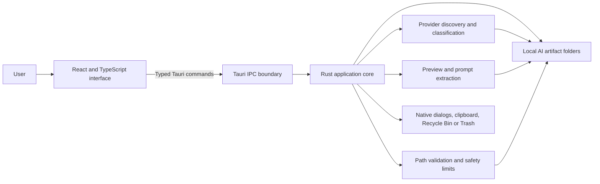

# BrAIn Browser architecture

BrAIn Browser is a local desktop application for discovering, viewing, editing, exporting, and removing artifacts created by AI tools. It uses a React user interface inside a Tauri desktop shell. A Rust process owns filesystem access and operating-system integration.

The application has no server component. Artifact discovery, parsing, preview generation, editing, and prompt aggregation run on the local computer.

## Architecture at a glance



The design separates responsibilities:

- The **React layer** manages application state and presentation.
- The **Tauri command layer** defines the operations available to the interface.
- The **Rust layer** validates requests and performs privileged filesystem work.
- The **operating system** supplies the webview, file dialogs, clipboard, application-data folders, and trash behavior.

## Technology stack

| Area | Technology | Purpose |
| --- | --- | --- |
| Desktop shell | Tauri 2 | Hosts the web interface in a native Windows or macOS application and exposes approved Rust commands. |
| Core application | Rust 2021 | Discovers files, validates paths, classifies artifacts, creates previews, saves edits, and invokes native file operations. |
| User interface | React 19 | Renders the three-panel browser, Prompt Timeline, metadata, editors, and confirmation flows. |
| UI language | TypeScript 6 | Defines typed data contracts and client-side behavior. |
| Frontend build | Vite 8 | Runs the development server and produces the static production bundle used by Tauri. |
| Serialization | Serde and `serde_json` | Converts data between Rust command results and TypeScript objects and parses JSON records. |
| Filesystem traversal | `walkdir` | Performs bounded recursive discovery without following symbolic links. |
| Native file dialogs | `rfd` | Selects custom folders and export destinations. |
| Recycle Bin and Trash | `trash` | Removes artifacts through the operating system instead of deleting them permanently. |
| Safe file replacement | `tempfile` | Writes edited text to a temporary file before replacing the original. |
| Clipboard | Tauri clipboard manager plugin | Copies preview text and paths. |
| Structured formatting | `yaml` and browser JSON APIs | Parses and formats YAML, JSON, and JSONL content. |
| Syntax highlighting | `prism-react-renderer` | Renders color-coded JSON and YAML without injecting generated HTML. |
| Markdown rendering | `react-markdown` and `remark-gfm` | Displays Markdown and GitHub-flavored Markdown. |
| Icons | Lucide React | Supplies interface icons. |
| Frontend tests | Vitest | Tests JSON, YAML, prompt-history, and artifact-filter behavior. |
| Backend tests | Rust test framework | Tests classification, path handling, prompt extraction, saving, and provider registration. |
| Continuous integration | GitHub Actions | Builds and tests on Windows and macOS. |

## Application layers

### React interface

`src/App.tsx` is the primary application component. It manages:

- The selected source and artifact.
- Source and artifact loading states.
- Search, sort, category-collapse, and zero-byte filtering state.
- Preview, edit, dirty, and save state.
- Confirmation prompts for discarding changes, removing custom folders, and moving files to trash.
- Switching between the aggregate Prompt Timeline and the three-panel artifact browser.

The interface is split into three visual areas:

1. **Sources panel** — lists Prompt Timeline, detected AI tools, and custom folders.
2. **Artifacts panel** — groups and filters files by artifact category.
3. **Viewer panel** — displays metadata, formatted previews, raw content, and editing controls.

`src/App.css` defines the complete desktop layout. Each panel has an independent constrained region so long source lists, artifact lists, and previews can scroll without moving the entire window.

### Specialized preview components

Preview behavior is divided into focused components:

- `JsonPreview.tsx` formats JSON and JSONL before syntax highlighting.
- `YamlPreview.tsx` parses and formats one or more YAML documents.
- `SyntaxPreview.tsx` renders highlighted tokens and line numbers.
- `JsonlSessionPreview.tsx` provides **Prompt History** and **Raw JSONL** views.
- `PromptTimelineView.tsx` renders the cross-provider prompt timeline.

The larger structured preview modules are loaded with React `lazy` and `Suspense`, which keeps them out of the initial interface bundle until they are needed.

### TypeScript-to-Rust command boundary

`src/api.ts` is the frontend command adapter. It uses Tauri's `invoke` function to call a limited set of Rust commands:

| Command | Responsibility |
| --- | --- |
| `get_sources` | Returns detected built-in sources and saved custom folders. |
| `get_prompt_timeline` | Scans approved JSONL files and returns recognized user prompts. |
| `list_artifacts` | Returns metadata and classification for files in one approved source. |
| `read_preview` | Reads a bounded text or image preview. |
| `save_artifact` | Saves an approved UTF-8 text artifact when its revision still matches. |
| `add_custom_folder` | Opens a native folder picker and saves the selected root. |
| `remove_custom_folder` | Removes a custom root from BrAIn Browser settings without deleting files. |
| `trash_artifact` | Moves a confirmed artifact to Recycle Bin or Trash. |
| `export_artifact` | Copies an artifact to a destination selected in a native save dialog. |

`src/types.ts` mirrors the serialized Rust models. Tauri converts Rust `snake_case` fields to TypeScript `camelCase` fields through Serde attributes.

### Rust application core

`src-tauri/src/lib.rs` contains the core application logic. Its main responsibilities are:

- Defining known AI providers and their platform-specific storage roots.
- Loading and saving custom-folder settings.
- Walking approved directories with fixed safety limits.
- Classifying artifacts by path, filename, extension, and bounded content signatures.
- Detecting MCP configuration files.
- Resolving preview and artifact types.
- Extracting prompt history from supported JSONL shapes.
- Enforcing the filesystem trust boundary.
- Performing native export, save, and trash operations.

`src-tauri/src/main.rs` is intentionally small. It starts the library entry point and suppresses the extra console window in Windows release builds.

## Source discovery

The backend maintains a catalog of known applications, including GitHub Copilot, Microsoft Copilot, Microsoft 365 Copilot, Claude, OpenAI, Perplexity, Gemini CLI, Continue, Cursor, Windsurf, and Cline.

Each provider can contribute one or more roots. For example, the unified **OpenAI** source combines shared Codex storage with detected ChatGPT Desktop package or container roots. A multi-root source prefixes relative paths with an internal root key so the backend can resolve the correct root later.

Discovery follows these rules:

- Known roots come from platform application-data locations, documented environment-variable overrides, or both.
- Windows package roots are found by bounded package-name matching.
- Custom folders are added only through the native folder picker.
- Symbolic links aren't followed during recursive scanning.
- Common development-noise directories such as `.git`, `node_modules`, `target`, and `__pycache__` are skipped.
- Browser profiles aren't scanned.
- Embedded `EBWebView` browser-profile directories are skipped when Microsoft package roots are traversed.

The backend returns unavailable built-in providers as disabled entries, allowing the interface to show which tools weren't detected.

## Artifact classification

Classification is heuristic because AI tools don't share a standard artifact schema. The backend uses path segments, filenames, extensions, and limited content inspection to group files into categories such as:

- Plans
- Session Logs
- Other Session Artifacts
- Memories
- Agents
- Skills
- Rules & Instructions
- Prompts
- MCP Configuration
- Extensions & Plugins
- Commands & Hooks
- Logs
- Credentials
- Caches
- Databases
- Configuration
- Images
- Other

Artifact-kind detection separately identifies documents, databases, archives, binaries, images, and opaque formats. This distinction controls icons, metadata, and available preview behavior.

MCP configuration detection checks known filenames first. For JSON, YAML, or TOML configuration files, it can also inspect the first 64 KB for bounded `mcpServers` signatures.

## Main data flows

### Load sources and artifacts

1. React calls `get_sources`.
2. Rust resolves the current home and application-data directories.
3. Rust constructs the approved roots for each provider and loads saved custom roots.
4. React displays the source list.
5. When the user selects a source, React calls `list_artifacts` with only the source ID.
6. Rust re-resolves that source, walks its roots, collects metadata, and classifies each file.
7. React filters, sorts, and groups the returned entries for display.

### Preview an artifact

1. React sends a source ID and relative path to `read_preview`.
2. Rust resolves the source from its approved catalog.
3. Rust validates the relative path, canonicalizes the root and target, and verifies that the target remains inside the approved root.
4. Rust returns a bounded text preview, an image data URL, or metadata for unsupported content.
5. React selects the appropriate renderer.

Formatting happens in the React layer so the original file remains unchanged:

- JSON uses two-space indentation.
- JSONL formats each record independently.
- YAML preserves multiple documents and formats with two-space indentation.
- Invalid structured content falls back to the original text with a warning.

### Edit and save text

1. A preview is editable only when it is complete, valid UTF-8, no larger than 1 MB, and uses a supported text format.
2. Rust returns a revision derived from the original bytes.
3. React enables **Save** only when the draft differs from the preview.
4. React sends the expected revision and updated content to `save_artifact`.
5. Rust revalidates the approved path and compares the current revision with the expected revision.
6. Rust writes a temporary file in the same directory, preserves permissions, flushes and synchronizes it, and replaces the original.

This optimistic-concurrency check prevents BrAIn Browser from silently overwriting a file changed by another application after it was opened.

### Move an artifact to trash

1. React asks for confirmation.
2. React calls `trash_artifact` with the source ID, relative path, and confirmation flag.
3. Rust rejects unconfirmed requests and revalidates the path.
4. The `trash` crate sends the file to Recycle Bin on Windows or Trash on macOS.

### Build the Prompt Timeline

1. Rust scans JSONL files in all available approved roots.
2. Canonical paths deduplicate files visible through overlapping roots.
3. Provider-specific and generic record shapes are normalized into one prompt model.
4. Assistant, model, tool, system, execution, function, and tool-result events are excluded.
5. Claude tool-result content blocks are excluded even when the enclosing protocol message uses a `user` role.
6. Records without their own timestamp use the file modification time and are marked as inferred.
7. The final collection is sorted newest-first and returned to React.

OpenAI prompt records use the unified **OpenAI** identity because the shared `history.jsonl` format contains the session ID, timestamp, and text but doesn't reliably identify whether ChatGPT Desktop or Codex wrote the entry.

## Security model

The Rust layer is the security boundary. The web interface doesn't receive unrestricted filesystem APIs.

### Approved roots

Every artifact operation starts with a source ID. The backend reconstructs the approved source and accepts only a relative path beneath one of its roots. It rejects:

- Absolute paths.
- Parent-directory traversal such as `..`.
- Root or platform-prefix components.
- Paths that canonicalize outside the approved root.
- Targets that aren't files.

This validation is repeated for reads, saves, exports, and trash operations.

### Bounded processing

The backend limits work to reduce memory use and prevent an unexpected directory layout from causing an unbounded scan.

| Limit | Value |
| --- | ---: |
| Files returned per artifact scan | 10,000 |
| Directory traversal depth | 10 |
| Text preview and edit size | 1 MB |
| Image preview size | 10 MB |
| Markdown title or MCP signature read | 64 KB |
| JSONL files in Prompt Timeline | 5,000 |
| Prompts in Prompt Timeline | 50,000 |

Binary detection checks the beginning of a candidate text file for null bytes. Unsupported, oversized, binary, proprietary, database, and opaque artifacts remain listed but aren't exposed as editable text.

### Webview restrictions

The Tauri content security policy allows local application content, embedded image data, inline styles required by the interface, and Tauri IPC. It doesn't permit arbitrary remote content.

Markdown is rendered through React components without enabling raw HTML. Syntax highlighting is token-based and doesn't inject artifact content as HTML.

### Privacy

The application doesn't include telemetry and doesn't send artifact contents to a network service. All provider discovery, classification, preview generation, editing, and prompt extraction happen locally.

## Project layout

```text
Brain_Browser/
├── src/
│   ├── App.tsx                    Main interface and state coordination
│   ├── App.css                    Desktop layout and visual styling
│   ├── api.ts                     Typed Tauri command wrappers
│   ├── types.ts                   Shared frontend data contracts
│   ├── PromptTimelineView.tsx     Aggregate prompt timeline
│   ├── JsonlSessionPreview.tsx    Prompt History and Raw JSONL tabs
│   ├── JsonPreview.tsx            JSON and JSONL preview
│   ├── YamlPreview.tsx            YAML preview
│   ├── SyntaxPreview.tsx          Token-based highlighted code view
│   ├── promptHistory.ts           JSONL prompt normalization
│   ├── jsonFormat.ts              JSON and JSONL formatting
│   ├── yamlFormat.ts              YAML parsing and formatting
│   └── artifactFilters.ts         Artifact-list filtering rules
├── src-tauri/
│   ├── src/main.rs                Native executable entry point
│   ├── src/lib.rs                 Rust application core and Tauri commands
│   ├── Cargo.toml                 Rust dependencies and release profile
│   └── tauri.conf.json            Window, security, build, and bundle settings
├── .github/workflows/ci.yml       Windows and macOS validation
├── package.json                   Frontend dependencies and scripts
└── README.md                      Product overview and development commands
```

## Build and release process

### Development

Run the Tauri development command:

```powershell
npm install
npm run tauri dev
```

Tauri starts the Vite development server at `http://localhost:1420`, compiles the Rust application, and opens the native window.

### Validation

Run the frontend and backend checks:

```powershell
npm test
npm run build
cargo fmt --manifest-path .\src-tauri\Cargo.toml -- --check
cargo test --manifest-path .\src-tauri\Cargo.toml
```

The GitHub Actions workflow performs the frontend build, Rust formatting check, Rust tests, and Tauri bundle build on both Windows and macOS.

### Packaging

Create platform bundles with:

```powershell
npm run tauri build
```

Tauri first runs the TypeScript compiler and Vite production build. Cargo then creates an optimized native executable with link-time optimization, one code-generation unit, stripped symbols, and abort-on-panic behavior.

Windows builds produce MSI and NSIS installers under `src-tauri\target\release\bundle`. macOS builds must run on macOS to produce the application and disk-image bundles.

## Design considerations

- **Local-first operation:** No service is required to browse local artifacts.
- **Small privileged surface:** Filesystem access is concentrated in Rust commands instead of exposed directly to React.
- **Provider isolation:** Built-in roots are explicit and bounded. Custom access requires a user-selected folder.
- **Schema tolerance:** Classification and prompt extraction support known shapes but preserve raw content when parsing fails.
- **Conservative editing:** Only complete, supported UTF-8 text previews can be modified.
- **Cross-platform native behavior:** Tauri and supporting Rust crates provide platform file dialogs, application paths, packaging, and trash operations.
- **Clear ambiguity:** Shared OpenAI history is labeled **OpenAI** rather than assigning an unsupported ChatGPT or Codex origin.

## Related content

- [BrAIn Browser overview and development instructions](README.md)
